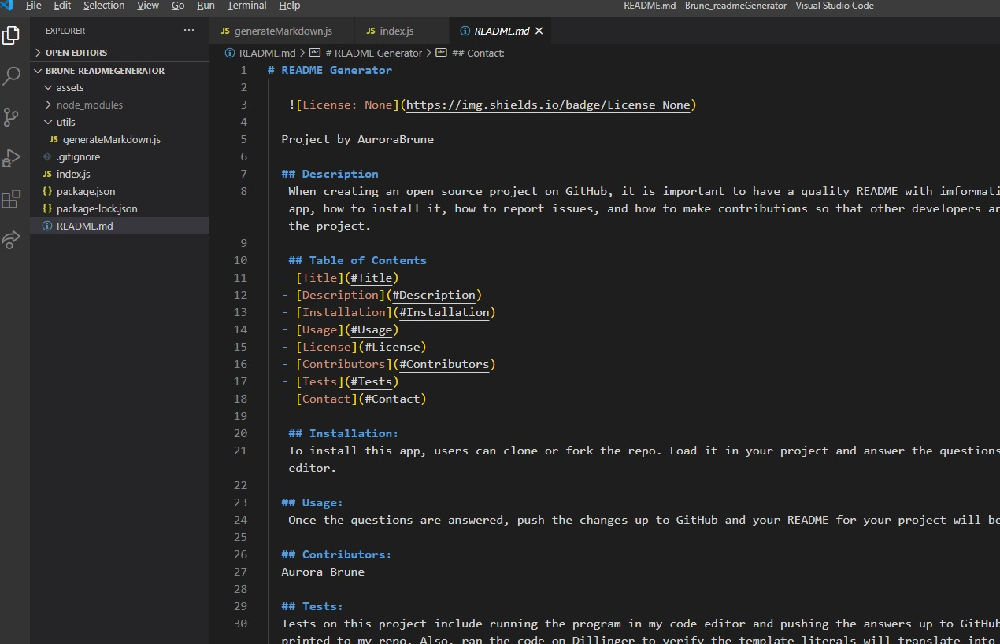
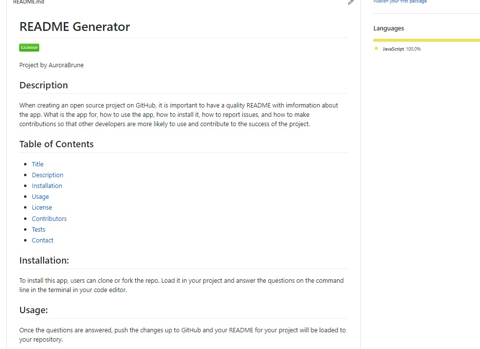

# README Generator

  

   
  --

--

--
  Project by AuroraBrune

  ## Description
   When creating an open source project on GitHub, it is important to have a quality README with information about the app. What is the app for, how to use the app, how to install it, how to report issues, and how to make contributions so that other developers are more likely to use and contribute to the success of the project. 

   ## Table of Contents
  - [Title](#Title)
  - [Description](#Description)
  - [Installation](#Installation)
  - [Usage](#Usage)
  - [License](#License)
  - [Contributors](#Contributors)
  - [Tests](#Tests)
  - [Contact](#Contact)

   ## Installation:
   To install this app, users can clone or fork the repo. Load it in your project and answer the questions that can be initiated by typng 'node index.js' on the command line in the terminal in your code editor. 

  ## Usage:
   Once the questions are answered, push the changes up to GitHub and your README for your project will be loaded to your repository. 

  ## Contributors:
  Aurora Brune

  ## Tests:
  Tests on this project include running the program in my code editor and pushing the answers up to GitHub to see that the README on this project have in fact printed to my repo. Also, ran the code on Dillinger to verify the template literals will translate into text. 

   ## Contact:
  If you have any questions or concerns, or would like to contribute, please contact me at akbrune@hotmail.com

------------------------
------------------------
Screenshot of the README on vs code
--
 
 -
 Screenshot of the README on GitHub
 --
 

 Video of the app. 
 https://drive.google.com/file/d/1V14v4Tt2LIJOZ3uiiC2_86op1JIsz0J1/view